[kishansuhi.ca](https://kishansuhi.ca) &nbsp;·&nbsp;
[linkedin](https://www.linkedin.com/in/kishansuhirthan/) &nbsp;·&nbsp;
[devpost]https://devpost.com/kishys)
[email](mailto:kishansuhirthan@gmail.com)

> im a 17 yr old app dev in toronto 🇨🇦 
> i love building apps and sites for ppl :)

im currently building [dashflow](https://github.com/kishys/dashflow) -> connecting HubSpot and Stripe, get AI-powered deal scoring, churn prediction,
 and revenue forecasting in minutes.

<samp>python &nbsp; java &nbsp; c &nbsp; typescript &nbsp; javascript &nbsp; react &nbsp; node &nbsp; tailwindcss &nbsp; </samp>

**[autobroll](https://github.com/andriidrok1/autobroll)** &nbsp;·&nbsp; <samp>typescript, remotion</samp> 
AI short-form video editor in the browser. Auto captions with accents, 
drag-and-retime editing, b-roll placement: transcript in, rendered video out.

**[strategy-checker](https://github.com/andriidrok1/strategy-checker)** &nbsp;·&nbsp; <samp>python</samp> 
Describe a trading strategy in plain English, get a real backtest with 
statistical validation. Exposes curve-fitting, not alpha.

**[compound](https://github.com/andriidrok1/compound)** &nbsp;·&nbsp; <samp>typescript, convex</samp> 
Autonomous research agent for your second brain. Built solo at Nozomio 
Hackathon, EF SF.

**[andriidrok.com](https://andriidrok.com)** &nbsp;·&nbsp; <samp>three.js, webgl</samp> 
Particle-morph portfolio: thousands of particles reshaping between scenes.

